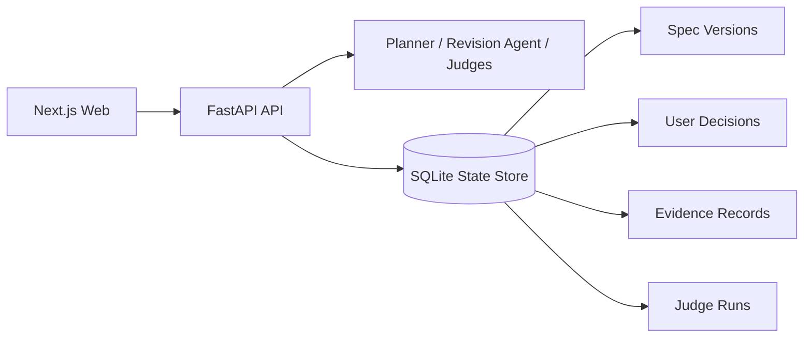

# SpecResearch Loop

SpecResearch Loop is a research-specification assistant that turns a research
idea into a versioned, reviewable research specification. The system supports
idea clarification, decomposition, source/evidence recording, experiment
planning, independent Judge reviews, user revisions, and final Markdown export.

## Objectives

- Convert an unstructured research idea into problem, gap, contribution, claim,
  evidence, experiment, and feasibility artifacts.
- Require evidence records before presenting a source as verified.
- Keep user decisions and immutable spec versions so a review can be traced.
- Run multiple Judge roles against the latest stored spec and record the exact
  version each Judge evaluated.

## Technology

| Layer       | Technology                            |
| ----------- | ------------------------------------- |
| Frontend    | Next.js 15, React 19, TypeScript      |
| Backend     | FastAPI, Pydantic, uv                 |
| Persistence | SQLite in a Docker volume             |
| Runtime     | Docker Desktop and Docker Compose     |
| AI adapter  | OpenAI-compatible API or local Ollama |

## Research Workflow

1. Enter and clarify a research idea.
2. Decompose the idea into problem, research question, gap, contribution,
   evidence, and constraint cards.
3. Record related-work sources, claims, passages, and verification verdicts.
4. Select and persist a research-gap decision.
5. Build claim-evidence cards, an experiment plan, and a feasibility estimate.
6. Generate a draft research specification.
7. Run five independent Judge roles: Gap, Contribution, Experiment, Evidence,
   and Conference Readiness.
8. Aggregate latest-version Judge consensus and issues.
9. Apply a user revision, create a new immutable spec version, and rerun Judge.
10. Inspect decision log/version diff, confirm, and export final Markdown.

## Key Capabilities

- Input-specific research workspace: the application does not prefill a fixed
  prompt-optimization example.
- Source/evidence records with `SUPPORTED`, `CONTRADICTED`, and `INSUFFICIENT`
  verdicts, each stored with source URL and quoted passage.
- Persistent user decisions for gap selection, revision strategy, and final
  publication confirmation.
- Version history and server-side unified diff between two spec versions.
- Judge provenance through `spec_version_used`; old Judge results become stale
  when a newer spec is created.
- Configurable AI runtime with transparent `live` or deterministic fallback
  mode.

## Architecture



More detail is available in [ARCHITECTURE.md](ARCHITECTURE.md).

## Quick Start

1. Copy the environment template:

   ```powershell
   Copy-Item .env.example .env
   ```

2. Configure an AI runtime in `.env`.

   For local Ollama:

   ```dotenv
   LLM_PROVIDER=ollama
   LLM_BASE_URL=http://host.docker.internal:11434/v1
   LLM_API_KEY=ollama
   LLM_MODEL=qwen3:4b
   ```

3. Start Docker Desktop, then run:

   ```powershell
   docker compose up --build
   ```

4. Open the services:
   - Web: http://localhost:3000
   - API documentation: http://localhost:8000/docs

## Project Structure

```text
apps/web/                 Next.js application
services/api/             FastAPI application and tests
dataset/use-cases.json    Example research use cases
docs/prompts.md           Planner, Judge, and Revision prompts
docs/evaluation-protocol.md  Baselines, metrics, and demo procedure
ARCHITECTURE.md           Architecture and state model
docker-compose.yml        Local runtime configuration
```

## Validation

Run backend acceptance tests:

```powershell
docker compose run --rm --no-deps --entrypoint sh api -c "cd /app && PYTHONPATH=/app uv run --no-project --with pytest --with httpx2 pytest"
```

Build the frontend:

```powershell
docker compose run --rm --no-deps web npm run build
```

## Submission Artifacts

- [Architecture](ARCHITECTURE.md)
- [Prompt catalogue](docs/prompts.md)
- [Use-case dataset](dataset/use-cases.json)
- [Evaluation protocol with two baselines](docs/evaluation-protocol.md)

## Evidence Scope

Step 3 allows a researcher to store a source URL, target claim, quote, and
verification verdict. The current release does not automatically crawl
scholarly databases; automatic search/retrieval is a planned integration.

## Local Development (Optional)

### Backend

- `cd services/api`
- `uv sync`
- `uv run uvicorn app.main:app --reload --port 8000`

### Frontend

- `cd apps/web`
- `npm install`
- `npm run dev`

## Future Improvements

- Add an external scholarly search/retrieval connector for automatic evidence collection.
- Add multi-provider Judge assignment to compare model bias.
- Add a full evaluation report generated from repeated use-case runs.
